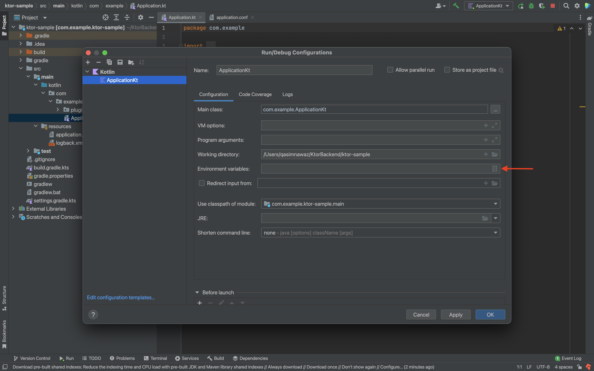
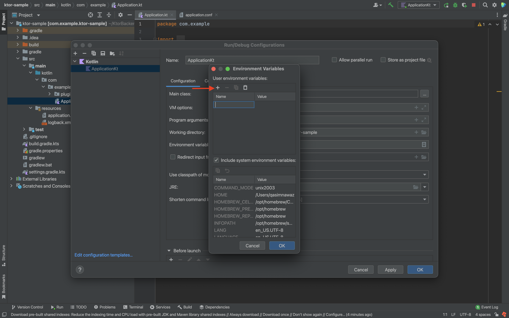
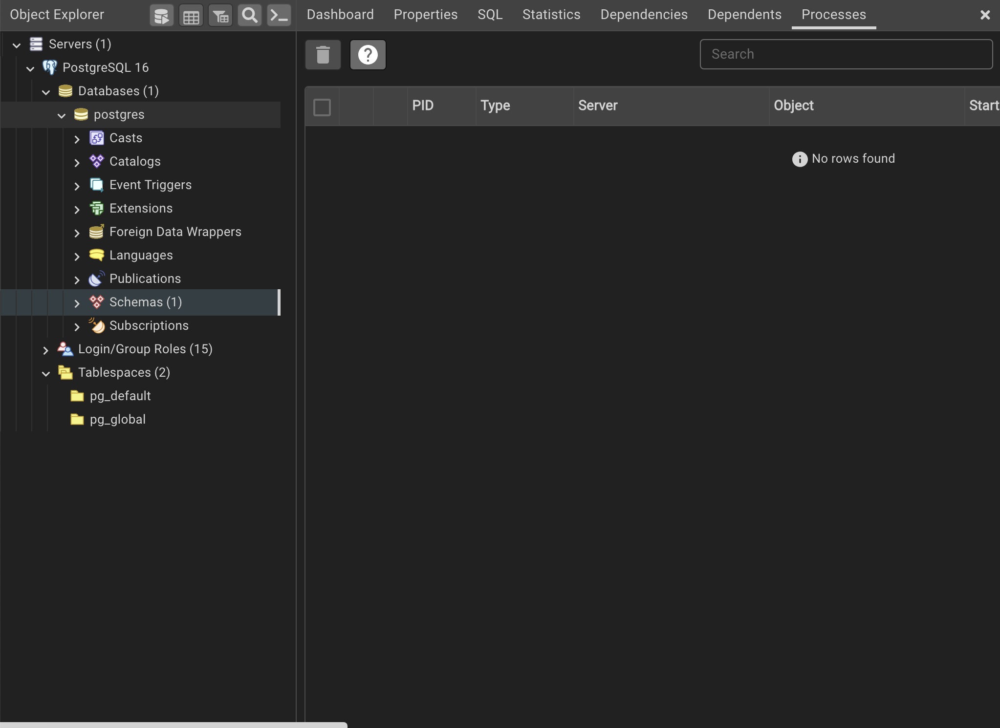

# CartWave eCommerce App

CartWave is a sample eCommerce mobile app backend developed using Ktor and PostgreSQL.

## Setting Up System Environment Variables in IntelliJ IDEA

### 1. Open Project in IntelliJ IDEA

- Open your CartWave project in IntelliJ IDEA.

### 2. Access Run/Debug Configurations

- Click on the top menu: **Run > Edit Configurations...**.

### 3. Edit Run Configuration

- In the Run/Debug Configurations window, select your main run configuration for the Ktor application (e.g., `ApplicationKt` or your main class).

### 4. Open Environment Variables Settings

- Look for the **Environment Variables** section in the Run/Debug Configuration window.

### 5. Add PostgreSQL Environment Variables

- Click on the **... (Edit environment variables)** next to the Environment Variables field to open the Environment Variables dialog.



- Click on the **+ (Add)** button to add new environment variables.
- Add the following environment variables:
    - `DRIVER`: org.postgresql.Driver
    - `LOCAL_DB_URL`: URL of pgAdmin database
    - `LOCAL_DB_USER_NAME`: Username to access the pgAdmin database
    - `LOCAL_DB_PASSWORD`: Password for the pgAdmin database
    - `REMOTE_DB_URL`: URL of ElephantSQL database
    - `REMOTE_DB_USER_NAME`: Username to access the ElephantSQL database
    - `REMOTE_DB_PASSWORD`: Password for the ElephantSQL database



### 6. Apply and Save Changes

- Click **OK** to save the environment variables and close the dialogs.

### 7. Use Environment Variables in Code

- In your Ktor application code open **DatabaseFactory**, access these environment variables to establish the PostgreSQL database connection.

## Setting Up pgAdmin for PostgreSQL

### 1. Download and Install pgAdmin

- Download pgAdmin from the [official website](https://www.pgadmin.org/download/) and follow the installation instructions based on your operating system.

### 2. Configure pgAdmin

- Launch pgAdmin after installation.
- Add a new server connection by providing the PostgreSQL server details (host, port, username, and password).



### 3. Access PostgreSQL Database

- Once connected, you can manage your PostgreSQL databases, tables, and perform queries using pgAdmin.

## Setting Up ElephantSQL

### 1. Visit ElephantSQL Website

- Visit the [ElephantSQL](https://www.elephantsql.com/) website.

### 2. Sign Up or Log In

- Sign up or log in to ElephantSQL.

### 3. Create an Instance

- Create a new instance by following the provided instructions.
- Obtain the connection details (host, port, username, password) for your ElephantSQL instance.

## Project Deployment

We wll go through step-by-step for deploying a Ktor project using Docker and deploying it on Fly.io.

## Deploying with Docker

### Step 1: Generate Fat JAR

```bash
./gradlew buildFatJar
```

This command generates a fat JAR file in the build/libs/ directory.

###Step 2: Install Docker Desktop

Follow the [instructions](https://docs.docker.com/get-docker/) to install desktop Docker application on your computer. It’s rather uncomplicated if you carefully follow all the steps and check that your computer meets all the system requirements.

###Step 3: Create Dockerfile

Create a file named Dockerfile in the root directory of the project and add the following code:
```bash
FROM openjdk:21
EXPOSE 8081:8081
RUN mkdir /app
COPY build/libs/name-of-file.jar /app/name-of-file.jar
ENTRYPOINT ["java","-jar","/app/name-of-file.jar"]
```
Replace name-of-file.jar with the actual name of the generated JAR file.

###Step 4: Build Docker Image
```bash
docker build -t image-name .
```
Replace image-name with your desired image name.

##Deploying on Fly.io

###Step 1: Install Flyctl Tool

Install the flyctl tool using Homebrew:
```bash
brew install flyctl
```

###Step 2: Sign Up for Fly.io
Authenticate by signing up for Fly.io:
```bash
flyctl auth signup
```

###Step 3: Create fly.toml
Generate a fly.toml file by running:
```bash
fly launch
```

###Step 4: Deploy to Fly.io
Deploy your application to Fly.io:
```bash
fly deploy
```

###Step 5: Set Environment Variables
Set your secrets for Fly.io using environment variables required for deployment:
```bash
flyctl secrets set DRIVER=org.postgresql.Driver REMOTE_DB_URL=url REMOTE_DB_USER_NAME=name REMOTE_DB_PASSWORD=password
```

Replace `DRIVER`, `REMOTE_DB_URL`, `REMOTE_DB_USER_NAME`, and `REMOTE_DB_PASSWORD` with your actual database credentials.

## Contributing

- Contributions are welcome! Fork this repository and submit a pull request with your changes.